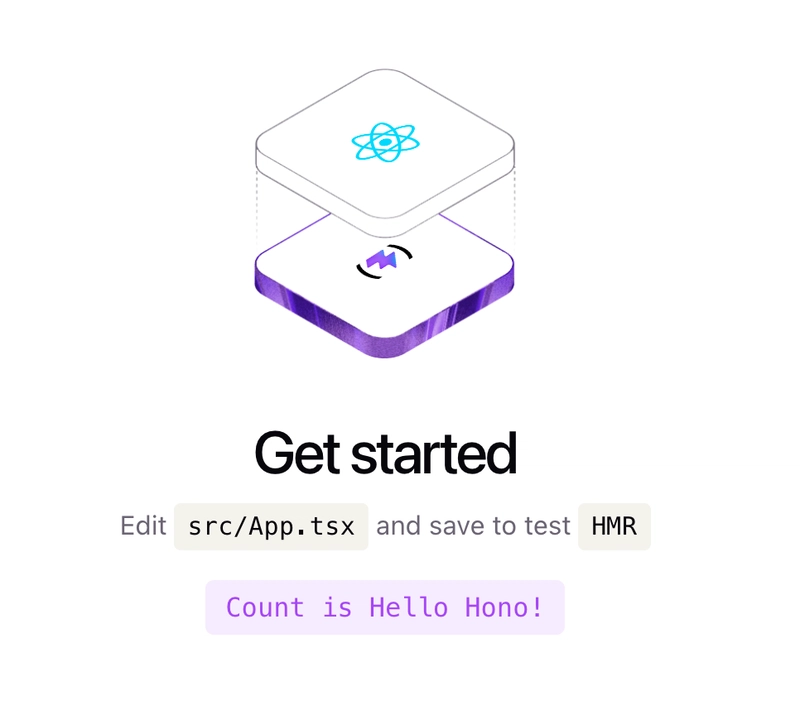

Hono RPC is a built-in feature of the Hono web framework that enables end‑to‑end type safety between your backend API and frontend client by automatically sharing and synchronising API specifications—without any code generation.

Let's see how we can create a monorepo with Hono API and a React app.

<h1 align="center">Hono RPC and React Monorepo Template 👨‍🍳</h1>
 

</img>

Using [Hono RPC](https://hono.dev/docs/guides/rpc) and pnpm [workspaces](https://pnpm.io/workspaces).

Please read [Hono RPC with React Monorepo Template](https://vladimir.vovk.in/blog/hono-rpc-and-react-monorepo-template) article for details.

## Quick start

1. Clone the repo: `git clone https://github.com/vladimir-vovk/hono-rpc-and-react-monorepo`.
2. Change directory to the project with `cd hono-rpc-and-react-monorepo` command.
3. Install dependencies: `pnpm i`.
4. Run both the api and web with `pnpm dev`.
5. Navigate to the `http://localhost:5173`. 🌎

Happy hacking! 🤓

## Features

- [pnpm](https://pnpm.io/)
- [TypeScript](https://www.typescriptlang.org/)
- [Node.js](https://nodejs.org/en)
- [Hono](https://hono.dev/)
- [Vite React](https://vite.dev/)

## Available commands

- `pnpm dev` - start apps in development.
